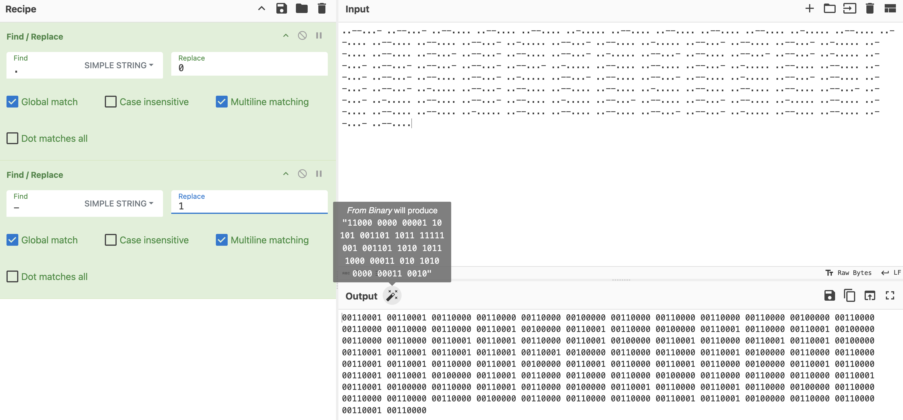
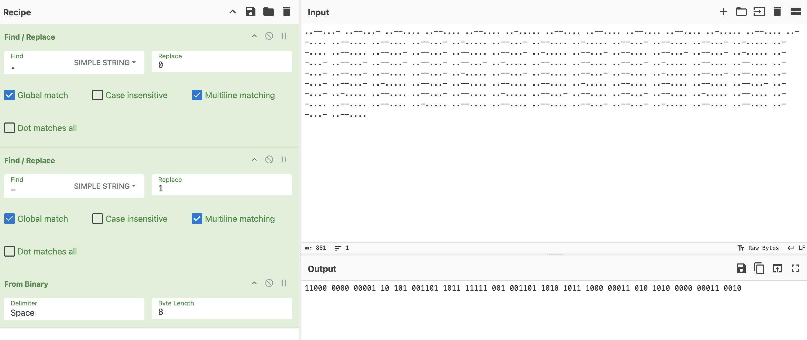
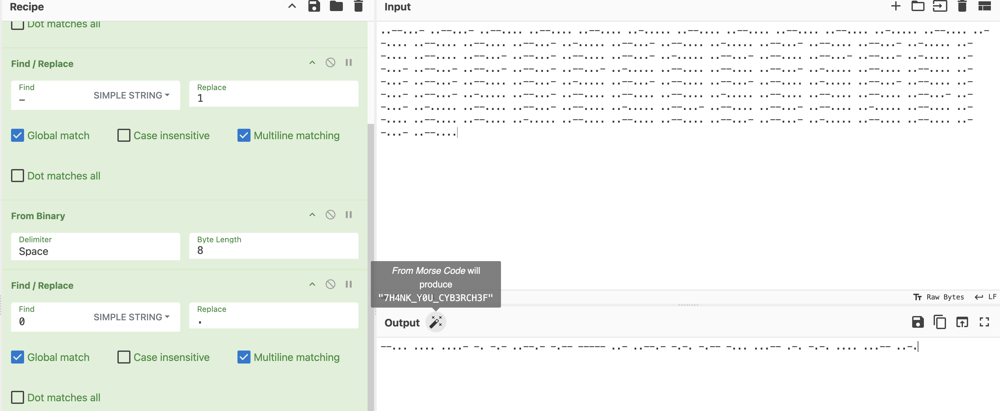

The challenge gives us the following text:
```
..--...- ..--...- ..--.... ..--.... ..--.... ..-..... ..--.... ..--.... ..--.... ..--.... ..-..... ..--.... ..--.... ..--.... ..--.... ..--...- ..-..... ..--...- ..--.... ..-..... ..--...- ..--.... ..--...- ..-..... ..--.... ..--.... ..--...- ..--...- ..--.... ..--...- ..-..... ..--...- ..--.... ..--...- ..--...- ..-..... ..--...- ..--...- ..--...- ..--...- ..--...- ..-..... ..--.... ..--.... ..--...- ..-..... ..--.... ..--.... ..--...- ..--...- ..--.... ..--...- ..-..... ..--...- ..--.... ..--...- ..--.... ..-..... ..--...- ..--.... ..--...- ..--...- ..-..... ..--...- ..--.... ..--.... ..--.... ..-..... ..--.... ..--.... ..--.... ..--...- ..--...- ..-..... ..--.... ..--...- ..--.... ..-..... ..--...- ..--.... ..--...- ..--.... ..-..... ..--.... ..--.... ..--.... ..--.... ..-..... ..--.... ..--.... ..--.... ..--...- ..--...- ..-..... ..--.... ..--.... ..--...- ..--....
```

We can quickly identify that these strings are 8 characters, and resembles binary instead of morse code.

Opening CyberChef, we convert the `.` characters to `0`, and `-` characters to `1`.


CyberChef suggests `From Binary`, which results in the following string:
```
11000 0000 00001 10 101 001101 1011 11111 001 001101 1010 1011 1000 00011 010 1010 0000 00011 0010
```


We now have strings of varying lengths that are composed by 0's and 1's. We see that this resembles morse code more than binary, so we convert the `0` characters to `.`, and `1` characters to `-`:

We get the following string:
```
--... .... ....- -. -.- ..--.- -.-- ----- ..- ..--.- -.-. -.-- -... ...-- .-. -.-. .... ...-- ..-.
```

CyberChef suggests that `From Morse Code` will produce `7H4NK_Y0U_CYB3RCH3F`

The flag is `SUCTF{7H4NK_Y0U_CYB3RCH3F}`