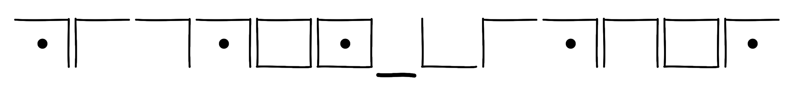

The challenge gives us the following cipher:

If we google a phrase like "symbol cipher", we get the following page: 
[List of Symbols Cipher](https://www.dcode.fr/symbols-ciphers)

From there, we see that the Pigpen Cipher resembles our cipher.

Opening a decoder, we enter the characters and get the flag:

Flag: `SUCTF{PIGPEN_CIPHER}`