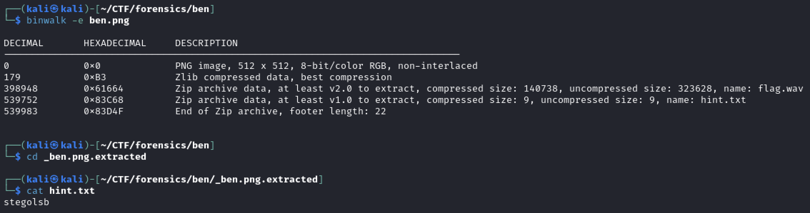
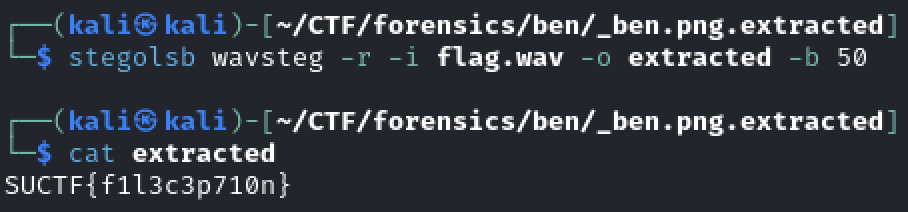

Use `binwalk -e ben.png` to extract the files inside.

See that there is a `hint.txt` file containing the word `stegolsb`, and a wav file `flag.wav`.

Install `stegolsb` with `pip install stego-lsb`

Use `stegolsb wavsteg -r -i flag.wav -o extracted` with a sufficient amount of bytes. The flag is 19 characters, but any value for the `-b` larger than 19 will also work.

Flag: `SUCTF{f1l3c3p710n}`