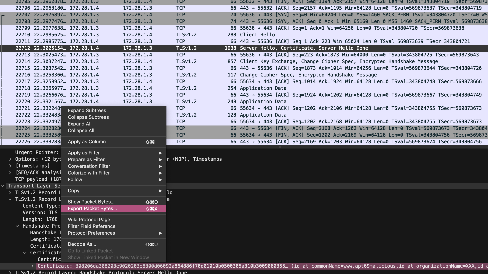

The provided file is a packet capture file, which can be opened using Wireshark.

After opening the file, we can see that all the packets are encrypted.
After analyzing the packets, there are 3 different hosts involved in the communication:

- 172.18.1.3
- 172.18.1.4
- 172.18.1.5

The communication between the hosts is encrypted using TLSv1.3, except for the communication between `172.18.1.3` and `172.18.1.4`, that is encrypted using TLSv1.2. Which is kind of a hint :)

When we inspect the TLSv1.2 packets, we can see that the server is sending a certificate to the client. The certificate is in the `Server Hello` packet.

We can extract the certificate from the packet, as can be seen in the following screenshot:



After extracting the certificate, we can save it as a `.pem` file and use `openssl` to extract the flag from it.

```bash
$ openssl x509 -inform DER -in certificate.der -text -noout > certificate.pem
```

After extracting the certificate, we can use various tools that can be found online for extracting private keys from certificates. One of the tools that can be used is [RsaCtfTool](https://github.com/RsaCtfTool/RsaCtfTool).

```bash
$ python3 RsaCtfTool.py --publickey certificate.pem --private
```

After running the command, we can see that the private key is extracted successfully.

Since this certificate is using already factorized parameters, we were able to extract the private key.

Now, we can use the private key to decrypt the TLSv1.2 packets.

We can use Wireshark to decrypt the packets using the private key.

To do this, we need to go to `Edit -> Preferences -> Protocols -> TLS` and add the private key file.

After adding the private key, we can see that the packets are decrypted.

We still have one more step to do, because flag is not in the decrypted packets.

After inspecting the decrypted packets, we can see that the server is sending a file to the client (Packet number 23375).

We can extract the file from the packet by following the HTTP stream.

After extracting the file, we can see that the file is TLS secrets log file. Meaning that, the file containts (Pre-)Master-Secrets for the TLS connections.

We can use the extracted (Pre-)Master-Secrets to decrypt the TLSv1.3 packets.

To do this, we need to go to `Edit -> Preferences -> Protocols -> TLS` and add the secrets log file.

After adding the secrets log file, we can see that the packets are decrypted.

Finally, by using a simple filter in Wireshark `http contains "CTF"`, we can find the flag (Packet number 15911).

Flag: `SUCTF{s0m3_c3rt1f1c4t3s_4r3_n0t_s3cur3}`