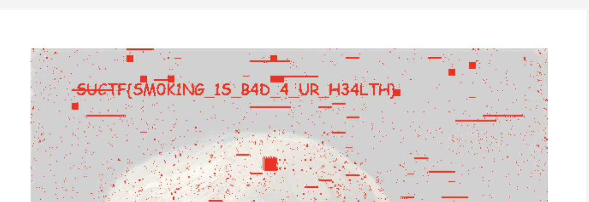

Find the hint at the metadata of the file:
```
└─$ exiftool Smoke_Break.png 
...
By-line                         : Gogh figure it out
```

With a google search like `Gogh smoking skeleton museum`, find the painting that the challenge description is suggesting:
https://www.vangoghmuseum.nl/en/collection/s0083v1962

Download the original painting:
https://www.vangoghmuseum.nl/asset/download/s0083V1962

Use an online image comparer such as https://www.img2go.com/compare-image, upload the challenge file and the original painting file, and see the flag:



Flag: `SUCTF{SM0K1NG_1S_B4D_4_UR_H34LTH}`