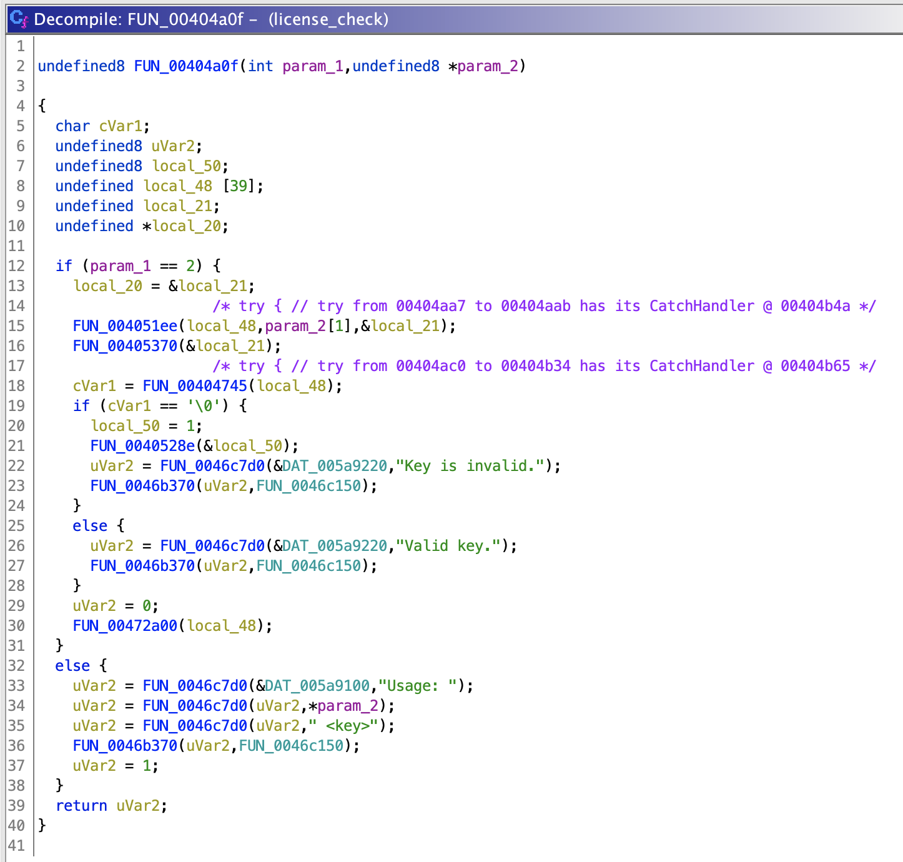
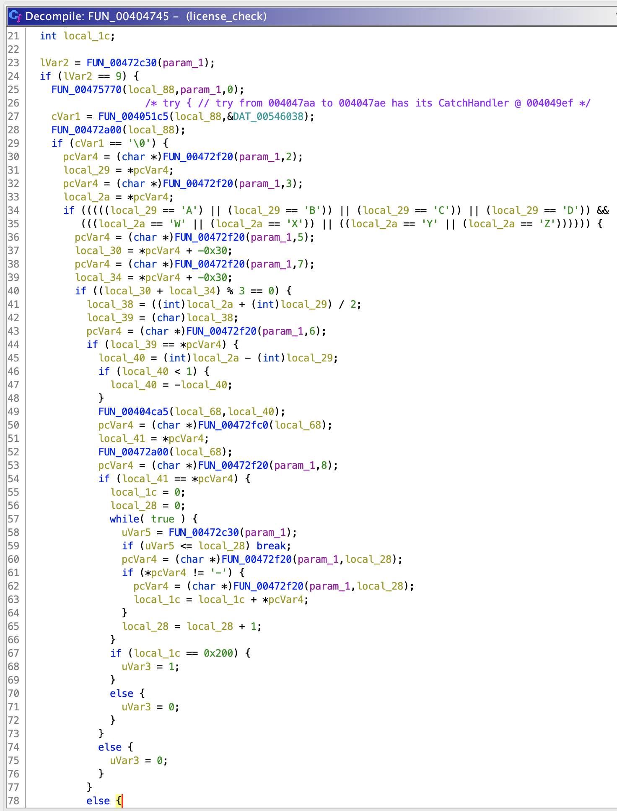

Use Ghidra or IDA Pro to find the main function:


Find the function responsible with key validation:


Spend some time to translate the decompiled code into clear C++ code. Find that the key validation algorithm works like this:
```cpp
bool validateKey(const std::string& key) {
    if (key.length() != 9) {
        return false;
    }

    if (key.substr(0, 2) != "K3") {
        return false;
    }

    char c3 = key[2];
    char c4 = key[3];
    if (!(c3 == 'A' || c3 == 'B' || c3 == 'C' || c3 == 'D') || !(c4 == 'W' || c4 == 'X' || c4 == 'Y' || c4 == 'Z')) {
        return false;
    }

    int n5 = key[5] - '0';
    int n7 = key[7] - '0';
    if ((n5 + n7) % 3 != 0) {
        return false;
    }

    int avg = (int(c3) + int(c4)) / 2;
    char c6 = char(avg);
    if (c6 != key[6]) {
        return false;
    }

    int diff = abs(int(c4) - int(c3));
    char c8 = std::to_string(diff).back();
    if (c8 != key[8]) {
        return false;
    }

    int sum = 0;
    for (size_t i = 0; i < key.length(); i++) {
        if (key[i] != '-') {
            sum += int(key[i]);
        }
    }
    if (sum != 512) {
        return false;
    }

    return true;
}
```

Using Python, create a script to generate keys that satisfy the conditions above:
```python
def generate_keys():
    chars_3 = ['A', 'B', 'C', 'D']
    chars_4 = ['W', 'X', 'Y', 'Z']
    
    for c3 in chars_3:
        for c4 in chars_4:
            for c5 in range(10):
                for c7 in range(10):
                    if (c5 + c7) % 3 == 0:
                        avg = (ord(c3) + ord(c4)) // 2
                        c6 = chr(avg)
                        diff = abs(ord(c4) - ord(c3))
                        c8 = str(diff)[-1]
                        string = f"K3{c3}{c4}-{c5}{c6}{c7}{c8}"
                        s = 0
                        for c in string:
                            if c != '-':
                                s += ord(c)
                        if s == 512:
                            yield string

keys = list(generate_keys())
print(','.join(keys[:50]))
```

The code will output 50 valid keys, which then you can enter to the server and get the flag.
```
Give me 50 license keys:
K3AW-3L92,K3AW-4L82,K3AW-5L72,K3AW-6L62,K3AW-7L52,K3AW-8L42,K3AW-9L32,K3BW-3L91,K3BW-4L81,K3BW-5L71,K3BW-6L61,K3BW-7L51,K3BW-8L41,K3BW-9L31,K3BX-0M92,K3BX-1M82,K3BX-2M72,K3BX-3M62,K3BX-4M52,K3BX-5M42,K3BX-6M32,K3BX-7M22,K3BX-8M12,K3BX-9M02,K3CX-0M91,K3CX-1M81,K3CX-2M71,K3CX-3M61,K3CX-4M51,K3CX-5M41,K3CX-6M31,K3CX-7M21,K3CX-8M11,K3CX-9M01,K3CY-0N62,K3CY-1N52,K3CY-2N42,K3CY-3N32,K3CY-4N22,K3CY-5N12,K3CY-6N02,K3DY-0N61,K3DY-1N51,K3DY-2N41,K3DY-3N31,K3DY-4N21,K3DY-5N11,K3DY-6N01,K3DZ-0O32,K3DZ-1O22

Great job! Here is the flag: SUCTF{y0u_4r3_4n_3l173_h4ck3r}
```

Flag: `SUCTF{y0u_4r3_4n_3l173_h4ck3r}`