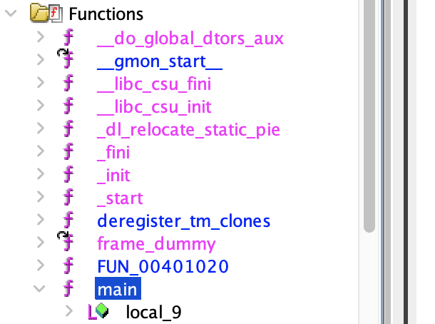
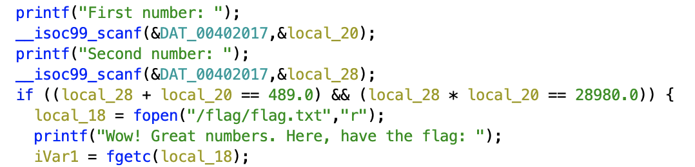

Put the binary in Ghidra, and click analyze. Click on the main function:

Look at the decompiled code, and see that the binary is making the following check:
`first + second == 489 && first * second == 28980`

Find that `first = 69` and `second = 420` satisfies the condition.

Enter these numbers to the server and get the flag.

Flag: `SUCTF{r3v3r51n6_15_fun}`