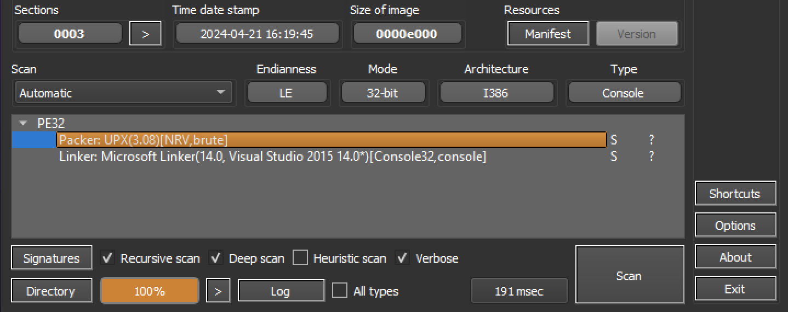

Run package.exe and see that it asks for a secret:
```
C:\Users\admin\Desktop>.\package.exe
Enter the secret: test
Sorry, wrong secret.
```

Open `package.exe` in Detect It Easy and find that it is packed with UPX


Unpack it with UPX in command line:
```
C:\Users\admin\Desktop>upx --decompress package.exe
                       Ultimate Packer for eXecutables
                          Copyright (C) 1996 - 2024
UPX 4.2.2       Markus Oberhumer, Laszlo Molnar & John Reiser    Jan 3rd 2024

        File size         Ratio      Format      Name
   --------------------   ------   -----------   -----------
     20992 <-     11264   53.66%    win32/pe     package.exe

Unpacked 1 file.
```

Check the strings inside the binary:
```
C:\Users\admin\Desktop>strings package.exe|findstr secret
Enter the secret:
extremely_secret_code_that_no_one_will_ever_find
Sorry, wrong secret.
```

Enter the secret code:
```
C:\Users\admin\Desktop>.\package.exe
Enter the secret: extremely_secret_code_that_no_one_will_ever_find
Congratulations! Here is the flag: SUCTF{p4ck3d_w1th_UPX}
```

Flag: `SUCTF{p4ck3d_w1th_UPX}`