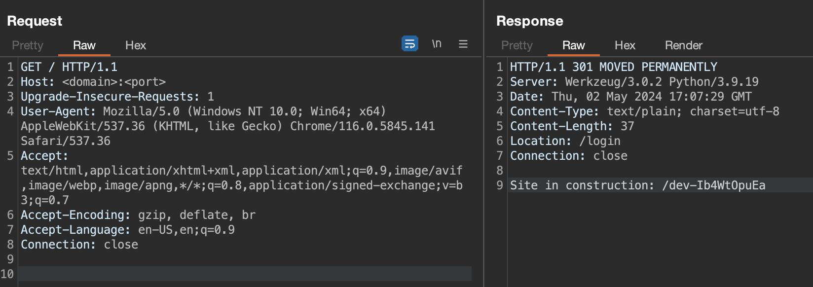

With Burp Suite open, visit the base URL. It will redirect to `/login`.


Observe that the redirect response also contains a body, which leaks a directory.

Visit the directory:
```
└─$ curl http://<domain>:<port>/dev-Ib4WtOpuEa
Login credentials: admin:edP3uR2U6s
```

Log in with these credentials and get the flag.

Flag: `SUCTF{b1g_r3dir3ct}`